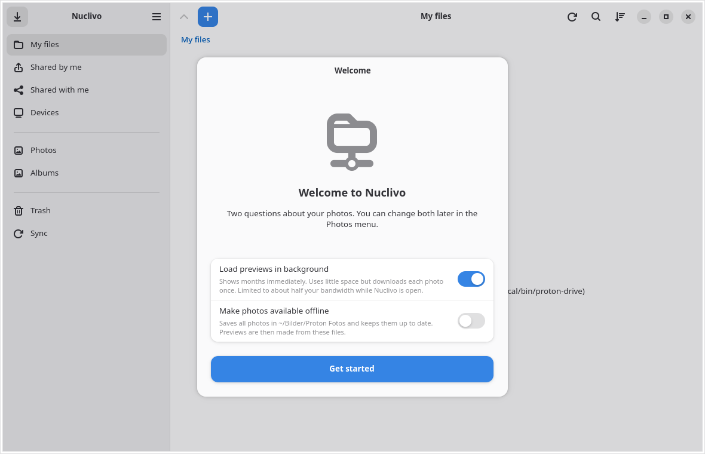
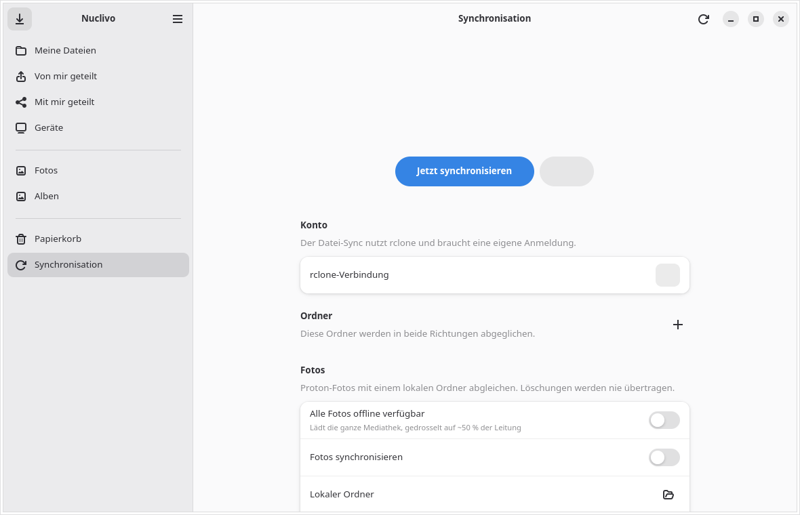

# Nuclivo

An unofficial Linux GUI for the Proton Drive CLI, built with Python, GTK 4 and libadwaita. German and English can be selected from the app's main menu under **Sprache / Language**; restart the app to apply a change. By default, Nuclivo follows the system language (German or English). Nuclivo is independent of Proton.

Browse and manage files, upload and download, manage sharing and albums, browse photos, and open Proton Docs through optional WebKitGTK integration. An optional daemon synchronizes folder pairs using rclone bisync and downloads/uploads photos through the official Proton Drive CLI.

**Experimental:** this source snapshot has received a targeted security review. Authentication, embedded Docs and bidirectional sync still need end-to-end validation using a disposable account and test folders before a stable release. Windows is not supported by this implementation.

**AI-generated code and data risk:** Nuclivo was entirely vibe coded with AI assistance. I cannot guarantee its security or the protection of your data. Use a disposable account and non-sensitive test files when evaluating it; keep backups before trying synchronization.

## Screenshots

Captured from isolated demo profiles without a Proton account or personal files. The CLI is intentionally absent, so these images show the setup and sync controls rather than connected Drive content.





## Roadmap

I also want to build a more practical Proton Drive desktop app for Windows, including photo synchronization. This is a plan, not a feature of the current Linux build.

## Contributing

Contributions are welcome, especially independent security audits and reviews of authentication, local data handling, and synchronization. Please use issues or pull requests for ordinary feedback. If you find a vulnerability that could expose accounts or files, report it privately through GitHub's vulnerability reporting feature when available, so it can be fixed before public disclosure.

## Requirements

- Python 3 with PyGObject, GTK 4, libadwaita and GdkPixbuf system packages.
- Official [Proton Drive CLI](https://github.com/ProtonDriveApps/sdk/tree/main/cli) at `~/.local/bin/proton-drive`. Source environment: CLI 0.8.0, SDK 0.21.0.
- Optional WebKitGTK 6.0 for embedded Proton Docs.
- Optional pyinotify and [rclone](https://rclone.org/protondrive/) at `~/.local/bin/rclone` for synchronization. Source environment: rclone 1.75.1.

Run the interface from this checkout:

```sh
python3 src/nuclivo.py
```

This uses the Proton CLI session already present on your computer. Nuclivo starts with its own settings and data paths. For an isolated review, set temporary XDG configuration, cache, data and state directories first. Do not run the daemon against important folders during evaluation.

The application ID, local paths, rclone remote and optional service all use the Nuclivo name. The earlier installation has separate settings. Stop its sync service before enabling Nuclivo sync so two daemons do not modify the same files.

For an installed copy, place all four Python files in `~/.local/share/nuclivo/`, the `packaging/nuclivo` launcher in `~/.local/bin/`, and the desktop file in `~/.local/share/applications/`. The optional unit in `packaging/` expects that location; place it in `~/.config/systemd/user/` and reload the user systemd manager. Starting it is an explicit opt-in and uses the configured sync pairs.

Configure the optional `nuclivo-proton` rclone remote using interactive `~/.local/bin/rclone config`. The GUI does not accept account passwords. Custom sharing passwords are managed in Proton's web app because the CLI currently takes them in process arguments.

## Local data and logout

Local downloaded files and thumbnails are decrypted. New app-created files are private to your user; new JSON files have mode 0600 and their parent directories mode 0700. Existing files from older installations are not recursively migrated.

CLI logout does not clear the separate embedded browser session, remove downloaded caches or stop/revoke rclone authentication. Pause the sync service and separately clear/revoke those sessions when removing account access. rclone's obscured passwords are recoverable, not secure encryption.

## Checks

```sh
python3 -m unittest discover -s tests -v
python3 -m compileall -q src
```

See [SECURITY_REVIEW.md](SECURITY_REVIEW.md) for findings and the limits of this review. A license decision and a live integration test remain before publication as a supported release.
